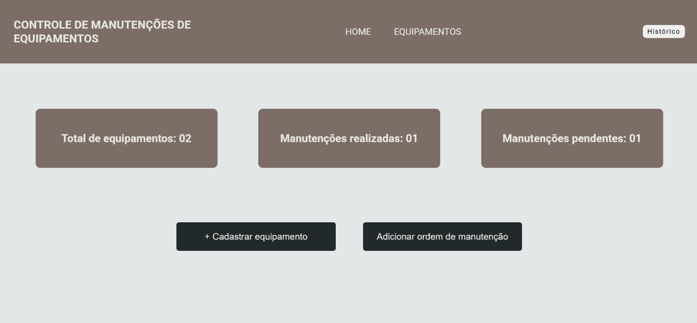
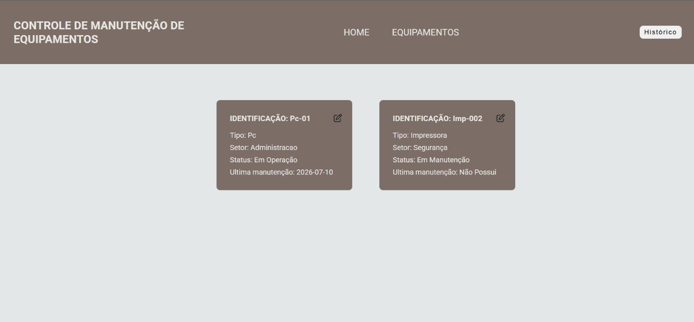
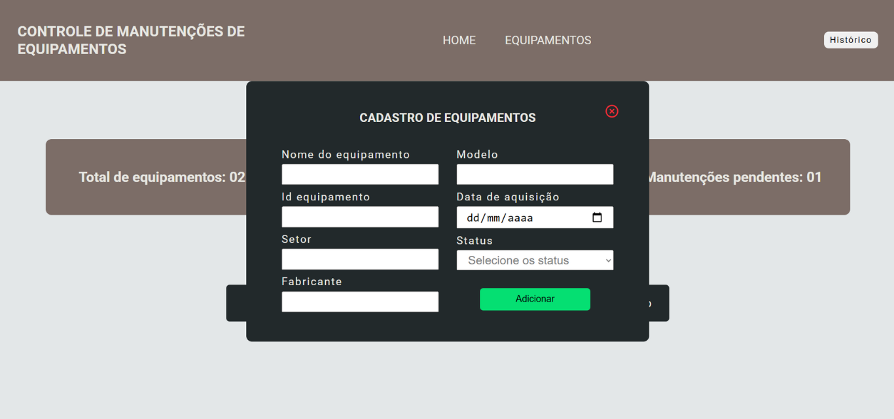
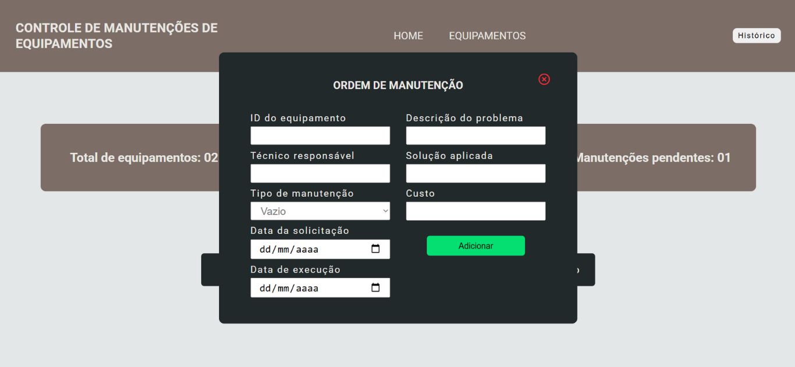
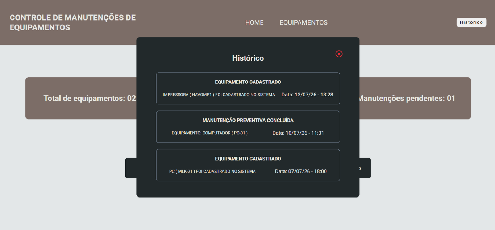

# 🔧 Sistema Web para Controle de Manutenções de Equipamentos

    
    
    
    
    

    

---

# 📖 Sobre o projeto

Este projeto consiste em um sistema web desenvolvido para realizar o **controle de equipamentos** e o **gerenciamento de manutenções**.

A aplicação foi criada para simular um ambiente empresarial, permitindo cadastrar equipamentos, registrar ordens de manutenção, acompanhar indicadores em tempo real e consultar todo o histórico de ações realizadas.

O principal objetivo foi aplicar, na prática, conceitos de desenvolvimento Full Stack utilizando tecnologias modernas do ecossistema JavaScript.

---

# 🎯 Objetivos

- Desenvolver uma aplicação Full Stack.
- Centralizar o gerenciamento de equipamentos.
- Controlar ordens de manutenção.
- Registrar o histórico completo das operações.
- Aplicar conceitos de API REST.
- Praticar integração entre Front-end e Back-end.

---

# ✨ Funcionalidades

## 📊 Dashboard

- Quantidade total de equipamentos
- Total de manutenções realizadas
- Manutenções pendentes
- Acesso rápido às principais funcionalidades

## 🖥 Equipamentos

- Cadastro de equipamentos
- Consulta de equipamentos
- Atualização de informações

## 🔧 Manutenções

- Cadastro de ordens de manutenção
- Seleção do equipamento
- Tipo de manutenção
- Técnico responsável
- Data da solicitação
- Data da execução
- Descrição do problema
- Solução aplicada
- Valor da manutenção

## 📜 Histórico

- Registro automático das ações
- Histórico completo das manutenções
- Consulta de todas as operações realizadas

---

# 🛠 Tecnologias utilizadas

### Front-end

- HTML5
- CSS3
- JavaScript

### Back-end

- Node.js
- Express.js

### Banco de Dados

- PostgreSQL
- Prisma ORM

### Comunicação

- Axios

---

# 📸 Demonstração

## Lista dos equipamentos

---

## Cadastro de Equipamentos

---

## Cadastro de Manutenção

---

## Histórico

---

# 💡 Conceitos aplicados

- CRUD completo
- API REST
- Arquitetura Cliente-Servidor
- Manipulação do DOM
- Programação assíncrona
- Express.js
- Prisma ORM
- PostgreSQL
- Validação de dados
- Organização em camadas

---

# 📄 Licença

Projeto desenvolvido para fins de portfólio.